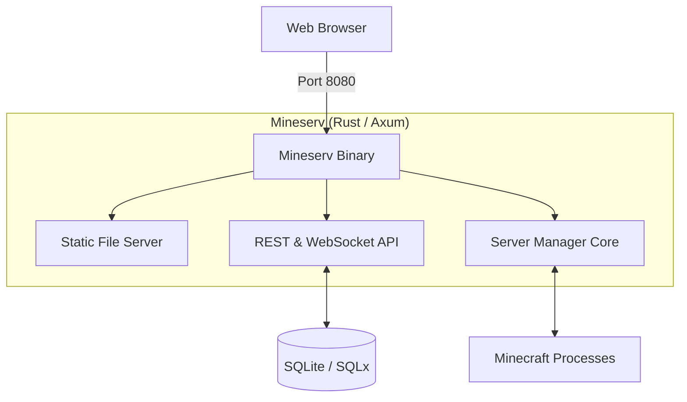

# Mineserv

[](https://opensource.org/licenses/MIT)
[](https://www.rust-lang.org/)
[](https://www.minecraft.net/)

**Mineserv** is an ultra-performant, full-stack Minecraft Server Manager built with Rust. It provides a sleek, glassmorphism-inspired web interface to manage multiple Paper and Spigot instances with ease, featuring intelligent process supervision and native Linux optimizations.

---

## 🚀 Key Features

### 🖥️ Integrated Web Stack
- **Unified Serving**: The Rust backend natively serves the frontend static files. No separate web server (Nginx/Node) required.
- **Glassmorphism UI**: A professional, responsive dark theme built with Vanilla JS for zero-overhead.
- **Real-time Console**: Low-latency WebSocket-based console streaming with command input.

### 🐧 Intelligent Linux Onboarding
- **Multi-Distro Support**: Optimized for **Oracle Linux 8+**, RHEL, Fedora, Ubuntu, Debian, and Arch.
- **Auto-Fix Logic**: Automatically detects and fixes repository issues or missing dependencies during installation.
- **Interactive Setup**: Guided configuration for administrator passwords, directories, and system-level performance tweaks.

### 📦 Management & Automation
- **Plugin Manager**: Instant search and installation of thousands of plugins via Modrinth integration.
- **World Management**: Seamless ZIP uploads, automated backups, and default world switching.
- **Resource Monitoring**: Real-time CPU and RAM tracking per instance with PID-aware recovery.

---

## 🏗️ Architecture

Mineserv is a unified binary that manages both the management API and the web interface.



---

## 🛠️ Installation & Setup

### Prerequisites
- **Rust**: 1.70+
- **Java**: JRE 21+ (Headless recommended)

### Quick Start
1. **Clone & Configure**:
   ```bash
   git clone https://github.com/MrSalsaa/mineserv.git
   cd mineserv
   cp .env.example .env 
   ```
2. **Launch**:
   ```bash
   cargo run --bin api-server
   ```
   *Access the web interface immediately at `http://localhost:8080`*

### Linux Production Deployment
For professional hosting, use the **Intelligent Onboarding Script**:
```bash
sudo bash scripts/setup_linux.sh
```
This script will:
1. Detect your OS (including **Oracle Linux 8** optimizations).
2. Install all dependencies with auto-fix logic.
3. Prompt for configuration (Admin Password, API Port, etc.).
4. Install and enable a **Systemd Service** that starts on boot.

---

## 📡 API Reference

| Endpoint                   | Method     | Description                         |
| -------------------------- | ---------- | ----------------------------------- |
| `/`                        | `GET`      | Serves the web interface            |
| `/api/auth/login`          | `POST`     | Authenticate with admin password    |
| `/api/servers`             | `GET/POST` | List or Create new server instances |
| `/api/servers/:id/console` | `WS`       | WebSocket console stream            |
| `/api/servers/:id/files`   | `GET/PUT`  | Browse and Edit instance files      |
| `/api/plugins/search`      | `GET`      | Search Modrinth for plugins         |

---

## 🛡️ Security
- **JWT Authentication**: Secured API endpoints.
- **Filesystem Isolation**: Servers are sandboxed in their own directories.
- **Native Security**: Optionally runs as its own non-root system user via the installer.

---

## 📝 License
Distributed under the MIT License. See `LICENSE` for more information.
